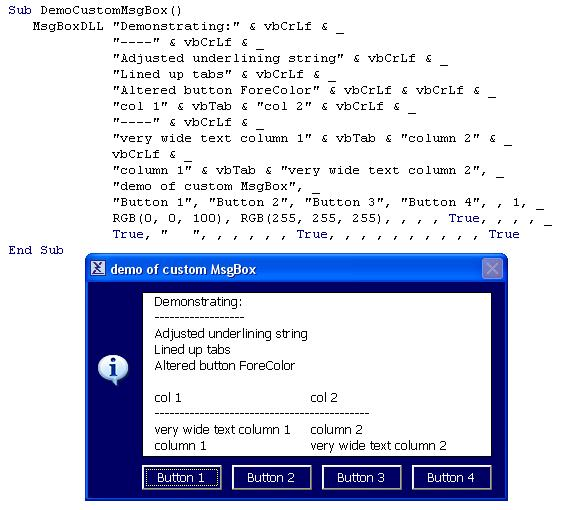

<div align="center">

## CustomMsgBox


</div>

### Description

Custom MsgBox with many powerful

options as can be seen from 44 input arguments:

----

1. vPrompt - MessagBox prompt text

2. vTitle - MessagBox prompt text

3. vButton1 - caption of first button, if nil specified will be: OK

4. vButton2 - caption of second button

5. vButton1 - caption of third button

6. vButton1 - caption of fourth button

7. btDefault - sets what the default button is, so what button has focus on startup

8. lMessageIcon - set the MessageBox icon:

nil specified: no icon

1: Information

2: Question

3: Exclamation

4: Warning

9. lFormColour - long value setting the BackColor of the MessageBox form, if nil specified will be the default VB MessageBox

colour. You can do black for example as the font will be set with a contrasting colour.

10. lLabelColour - long value setting the BackColor of the Prompt textbox, if nil specified will be same as lFormColour

11. lButtonColour - long value setting the BackColor of the buttons, if nil specified will be same as lFormColour

12. lLabelFontColour - long value setting the ForeColor of the Prompt textbox, if nil specified will be a contrasting colour

compared to the Prompt BackColor

13. lMaxLen - maximum number of characters in the Prompt text before a linebreak will occur, default 125

14. bPromptBorder - boolean, if True Prompt textbox will have a border

15. bIndentAfterBreak - boolean, if true there will be an indent after a linebreak in the prompt text.

16. bOnlyIndentWithNumericFirstChar - boolean only applies if bIndentAfterBreak is True. If bOnlyIndentWithNumericFirstChar

is True then then indent will only happen if the line started with a number.

17. strIndent - the indenting string

18. bStartLineWithSpacer - if True every new line in the Prompt will start with a spacing string. Useful when the Prompt

textbox has a border.

19. strSpacer - the spacer string, only applies if bStartLineWithSpacer is True

20. siPromptButtonFontSize - Single value, button font size, default is 10

21. lMinButtonWidth - long value, minimum button width, default is 1200

22. lMinButtonGap - Long value, minimum space between buttons, default is 150

23. lButtonEdge - Long value, minimum space between button edge and button caption, default is 150

24. bSpaceButtons - if True buttons will be spaced evenly between left and right border of Prompt textbox

25. bAdjustUnderlineStrings - if True this will make the string that comes after a specified linebreak the same length as the line above. This works if this underlining string is 

----

or 

----

, so 4 of these characters.

26. bShowTitleIcon - if True will show the title caption icon, default is True. Of course this icon can be changed.

27. bCenterPrompt - If True the text in the Prompt textbox will be centered

28. bInput - If True it will be an InputBox

29. vInputDefault - default InputBox value

30. bNumericInput - If True InputBox will only accept numeric input

31. bIntegerOnly - will only apply if bNumericInput is True. In that case only integer numbers will be allowed

32. vMinValue - will only apply if bNumericInput is True. Minimum allowed input value

33. vMaxValue - will only apply if bNumericInput is True. Maximum allowed input value

34. bBeep - Beep when the Msgbox loads

35. bLineUpTabs - if True tabs will be lined up in columns

36. strTabSpacer - string used to line up tabs, default is chr(32)

37. strTabSpacer - long value, minimum number of strTabSpacer characters to line up tabs

38. bAddTab - if True will add vbTab to spacer string, recommended to line up precisely

39. vTooltip1 - Tooltip text for button 1

40. vTooltip2 - Tooltip text for button 2

41. vTooltip3 - Tooltip text for button 3

42. vTooltip4 - Tooltip text for button 4

43. lActiveButtonColour - colour of the button that is moved over by the mouse

44. bReturnLineNumber - with a mouse right-click return the line number in the prompt where the cursor is, rather than the button caption.
 
### More Info
 
44 optional arguments as explained

Included is a demo text file that holds a Sub demonstrating all features of this MsgBox.

Code geared up to use with Excel VBA, but can easily be altered to work with othet Office apps or VB.

Demo text file included with a Sub that demonstrates all options.

Caption of the pressed button or text of the input textbox or line number of the prompt box where the cursor is.

Nil that I am aware of.


<span>             |<span>
---                |---
**Submitted On**   |2007-11-12 22:01:22
**By**             |[RB Smissaert](https://github.com/Planet-Source-Code/PSCIndex/blob/master/ByAuthor/rb-smissaert.md)
**Level**          |Intermediate
**User Rating**    |4.8 (29 globes from 6 users)
**Compatibility**  |VB 6\.0, VBA MS Access, VBA MS Excel
**Category**       |[Complete Applications](https://github.com/Planet-Source-Code/PSCIndex/blob/master/ByCategory/complete-applications__1-27.md)
**World**          |[Visual Basic](https://github.com/Planet-Source-Code/PSCIndex/blob/master/ByWorld/visual-basic.md)
**Archive File**   |[CustomMsgB20907511142007\.zip](https://github.com/Planet-Source-Code/rb-smissaert-custommsgbox__1-65065/archive/master.zip)

### API Declarations

```
Private Declare Function GetMenuItemCount Lib "user32" _
 (ByVal hMenu As Long) As Long
Private Declare Function GetSystemMenu Lib "user32" _
 (ByVal hwnd As Long, _
 ByVal bRevert As Long) As Long
Private Declare Function RemoveMenu Lib "user32" _
 (ByVal hMenu As Long, _
 ByVal nPosition As Long, _
 ByVal wFlags As Long) _
 As Long
Private Declare Function LoadStandardIcon Lib "user32" _
 Alias "LoadIconA" _
 (ByVal hInstance As Long, _
 ByVal lpIconNum As enStandardIconEnum) _
 As Long
Private Declare Function DrawIcon Lib "user32" _
 (ByVal hdc As Long, _
 ByVal X As Long, _
 ByVal Y As Long, _
 ByVal hIcon As Long) As Long
Private Declare Function SetForegroundWindow _
 Lib "user32" (ByVal hwnd As Long) As Long
```


